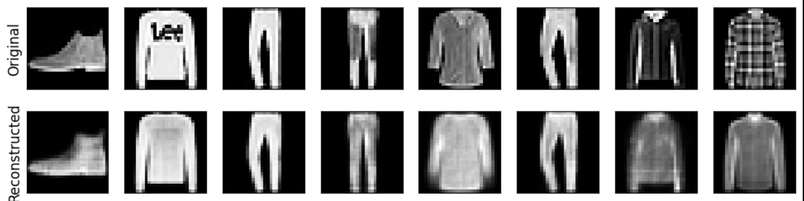
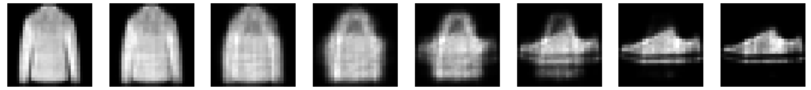

# Variational Autoencoder (VAE) on Fashion-MNIST

## Overview

This repository contains a PyTorch implementation of a **Variational Autoencoder (VAE)** trained on the **Fashion-MNIST** dataset. 
This VAE learns a continuous latent representation of grayscale images of clothing images, enabling image generation.

The structure of the project:

* Building and training a fully connected VAE.
* Computing the reconstruction and KL-divergence loss.
* Visualize the reconstructions and compare them with the original images.
* Sampling from the latent space to generate new images.

---

## Dataset

**Fashion-MNIST** is a dataset of 28×28 grayscale images of 10 fashion categories (e.g., t-shirts, trousers, shoes).

* Training samples: 60,000
* Test samples: 10,000

The dataset is automatically downloaded using `torchvision.datasets.FashionMNIST`.

---

## Requirements

* Python 3.8+
* PyTorch 2.x
* torchvision
* matplotlib
* numpy

You can install these dependencies with:

```bash
pip install torch torchvision matplotlib numpy
```

---

## Results

* **Loss function** exhibits stable convergence.
* The **reconstructed images** are very similar to the original images and show that the reconstruction preserves the global structures.
* **Latent space sampling** produces smooth and plausible variations.

<table style="width:100%">
  <tr>
    <th>Original vs. Reconstruction</th>
  </tr>
  <tr>
    <td></td>
  </tr>
  <tr>
    <th>Interpolation between two generated samples</th>
  </tr>
  <tr>
    <td></td>
  </tr>
</table>

---

## Future Improvements

* Use **convolutional VAE (Conv-VAE)** for sharper images and better understanding of local characteristics.
* Use a deeper model with multiple convolutional and pooling layers
* Use data augmentation to multiply the data set and make the model more robust to small changes.

---

## References

* [Fashion-MNIST dataset](https://www.kaggle.com/datasets/zalando-research/fashionmnist))
